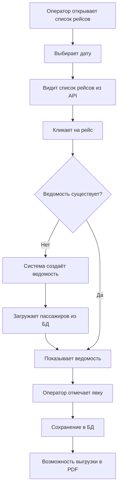

# Система работы с рейсами и ведомостями

## Обзор

Система NotifyBus работает с рейсами из внешнего API перевозчика (РФБАС) и управляет посадочными ведомостями для контроля явки пассажиров.

## Архитектура

### Источник данных о рейсах

Рейсы **не хранятся** в локальной БД полностью. Вместо этого:
- Данные рейсов получаются из внешнего API перевозчика в реальном времени
- В БД сохраняются только **ведомости** для контроля явки пассажиров
- Ведомости создаются **по требованию** при первом открытии оператором

### Уникальность рейса

Каждый рейс в API имеет:
- `id` — ID конкретного рейса (может повторяться при разных станциях назначения)
- `id_route` — **уникальный** ID маршрута
- `dt_depart` — время отправления

**Ключ для идентификации ведомости:** `(provider, id_route, dt_depart)`

### Пример данных рейса из API

```json
{
  "id": "4281182",
  "id_route": "41980",
  "id_bus": "24429",
  "dt_race_start": "2026-01-28T00:30:00Z",
  "dt_depart": "2026-01-28T00:30:00Z",
  "dt_arrive": "2026-01-28T06:36:00Z",
  "active": true,
  "tkt_count": 28,
  "sits_count": 51,
  "route": "504",
  "route_start": "Южно-Сахалинск, ЖД Вокзал",
  "route_end": "Александровск-Сахалинский, Автостанция",
  "model": "YUTONG",
  "gn": "Н547ОВ65",
  "provider": "РФБАС",
  "from_id": "83360",
  "to_id": "86814"
}
```

## База данных

### Таблица `trip_manifests`

Хранит шапку посадочной ведомости (один рейс = одна ведомость):

```sql
CREATE TABLE trip_manifests (
    id BIGINT PRIMARY KEY,
    provider VARCHAR(255) DEFAULT 'РФБАС',
    external_route_id VARCHAR(255),      -- id_route из API
    external_trip_id VARCHAR(255),       -- id из API (для справки)
    dt_depart DATETIME,                  -- время отправления
    dt_arrive DATETIME,                  -- время прибытия
    from_id VARCHAR(255),                -- ID станции отправления
    to_id VARCHAR(255),                  -- ID станции назначения
    from_name VARCHAR(255),              -- название станции отправления
    to_name VARCHAR(255),                -- название станции назначения
    route_number VARCHAR(255),           -- номер маршрута
    bus_number VARCHAR(255),             -- госномер автобуса
    vehicle_model VARCHAR(255),          -- модель транспорта
    carrier_name VARCHAR(255),           -- название перевозчика
    created_by BIGINT,                   -- FK к users
    updated_by BIGINT,                   -- FK к users
    status ENUM('draft', 'final') DEFAULT 'draft',
    created_at TIMESTAMP,
    updated_at TIMESTAMP,
    
    UNIQUE KEY unique_manifest (provider, external_route_id, dt_depart)
);
```

### Таблица `trip_manifest_items`

Хранит отметки явки пассажиров (связь manifest ↔ passenger):

```sql
CREATE TABLE trip_manifest_items (
    id BIGINT PRIMARY KEY,
    manifest_id BIGINT,                  -- FK к trip_manifests
    passenger_id BIGINT,                 -- FK к passengers
    checked_in BOOLEAN NULL,             -- NULL=не отмечен, true=явился, false=не явился
    checked_in_at DATETIME,              -- когда отметили
    checked_in_by BIGINT,                -- FK к users (кто отметил)
    created_at TIMESTAMP,
    updated_at TIMESTAMP,
    
    UNIQUE KEY (manifest_id, passenger_id),
    FOREIGN KEY (manifest_id) REFERENCES trip_manifests(id) ON DELETE CASCADE,
    FOREIGN KEY (passenger_id) REFERENCES passengers(id) ON DELETE CASCADE
);
```

### Связи

```
TripManifest (1) ──→ (N) TripManifestItem (N) ──→ (1) Passenger
```

**Данные пассажира** (ФИО, место, документы, телефон) хранятся в таблице `passengers` и берутся через связь — **не дублируем!**

## API Endpoints

### 1. Получить/создать ведомость

```http
GET /api/manifests/{externalRouteId}?dt_depart={iso8601}&external_trip_id={id}
```

**Параметры:**
- `externalRouteId` — id_route из API
- `dt_depart` — время отправления (ISO 8601)
- `external_trip_id` — id рейса из API
- `provider` — провайдер (опционально, по умолчанию "РФБАС")

**Логика:**
1. Ищет ведомость по `(provider, external_route_id, dt_depart)`
2. Если не найдена — создаёт новую:
   - Создаёт запись в `trip_manifests`
   - Загружает всех пассажиров из `passengers` по `external_race_id`
   - Создаёт записи в `trip_manifest_items` для каждого пассажира
3. Возвращает ведомость с пассажирами и их статусами явки

**Ответ:**
```json
{
  "success": true,
  "data": {
    "manifest": {
      "id": 1,
      "provider": "РФБАС",
      "external_route_id": "41980",
      "route_number": "504",
      "dt_depart": "2026-01-28T00:30:00Z",
      ...
    },
    "items": [
      {
        "id": 1,
        "manifest_id": 1,
        "passenger_id": 123,
        "checked_in": true,
        "checked_in_at": "2026-01-28T10:00:00Z",
        "passenger": {
          "id": 123,
          "full_name": "Иванов Иван Иванович",
          "seat_number": "12",
          "phone": "+79000000000",
          ...
        }
      }
    ],
    "stats": {
      "total": 28,
      "checked_in": 20,
      "not_checked_in": 5,
      "pending": 3
    }
  }
}
```

### 2. Отметить явку пассажира

```http
POST /api/manifests/{manifestId}/check-in
Content-Type: application/json

{
  "item_id": 123,
  "checked_in": true
}
```

**Параметры:**
- `manifestId` — ID ведомости
- `item_id` — ID записи в trip_manifest_items
- `checked_in` — true (явился) / false (не явился)

**Логика:**
- Обновляет поля `checked_in`, `checked_in_at`, `checked_in_by` в `trip_manifest_items`
- Сохраняет кто и когда отметил явку

**Ответ:**
```json
{
  "success": true,
  "message": "Отметка сохранена",
  "data": {
    "item_id": 123,
    "checked_in": true,
    "checked_in_at": "2026-01-28T10:00:00Z",
    "checked_in_by": 5
  }
}
```

### 3. Экспорт ведомости в PDF

```http
GET /api/manifests/{manifestId}/pdf
```

**Параметры:**
- `manifestId` — ID ведомости

**Логика:**
- Загружает ведомость с пассажирами и отметками явки из БД
- Генерирует PDF документ используя blade-шаблон `resources/views/pdf/manifest.blade.php`
- Возвращает файл для скачивания с именем `vedomost_{route_number}_{date}.pdf`

**Формат PDF:**
- Ориентация: Альбомная (landscape)
- Размер: A4
- Содержит: шапку с информацией о рейсе, таблицу пассажиров, статистику явки
- Отметки: ✓ (явился), ✗ (не явился), — (не отмечен)

## Работа с фронтендом

### Страница ведомости рейса

**URL:** `/dashboard/trips/{externalId}`

**Файл:** `resources/views/dashboard/trip-details.blade.php`

**Логика загрузки:**

1. При открытии страницы:
   ```javascript
   // Загрузить данные рейса из sessionStorage (если есть)
   const tripData = sessionStorage.getItem('trip_data_' + externalId);
   
   // Получить id_route из tripData
   const externalRouteId = tripData.id_route;
   
   // Запросить ведомость
   GET /api/manifests/{externalRouteId}?dt_depart={tripData.dt_depart}&...
   ```

2. При клике на "Контр." (колонка контроля явки):
   ```javascript
   POST /api/manifests/{manifestId}/check-in
   {
     "item_id": passenger.manifest_item_id,
     "checked_in": true/false
   }
   ```

### Состояния явки

- `NULL` — не отмечен (отображается как `—`)
- `true` — явился (отображается как `✓`)
- `false` — не явился (отображается как `✗`)

## Поток работы оператора



## Преимущества подхода

1. ✅ **Не нужно хранить все рейсы локально** — экономия места и синхронизации
2. ✅ **Ведомость создаётся по требованию** — только для нужных рейсов
3. ✅ **Явка сохраняется централизованно** — доступна всем операторам
4. ✅ **История изменений** — кто и когда отметил явку
5. ✅ **PDF формируется из БД** — не зависит от доступности внешнего API
6. ✅ **Масштабируемость** — легко добавить новые функции (статистика, отчёты)

## Миграции

```bash
# Применить миграции
php artisan migrate

# Откатить последние 2 миграции (если нужно)
php artisan migrate:rollback --step=2
```

**Файлы миграций:**
- `database/migrations/2026_01_29_000001_create_trip_manifests_table.php`
- `database/migrations/2026_01_29_000002_create_trip_manifest_items_table.php`

## Модели Laravel

**Файлы:**
- `app/Models/TripManifest.php`
- `app/Models/TripManifestItem.php`

**Основные методы:**

```php
// TripManifest
$manifest->items; // HasMany TripManifestItem
$manifest->passengers; // HasManyThrough Passenger
$manifest->getCheckedInCount(); // Количество явившихся
$manifest->getNotCheckedInCount(); // Количество не явившихся
$manifest->getPendingCount(); // Количество не отмеченных

// TripManifestItem
$item->manifest; // BelongsTo TripManifest
$item->passenger; // BelongsTo Passenger
$item->checkedInBy; // BelongsTo User
$item->markCheckedIn($userId); // Отметить явку
$item->markNotCheckedIn($userId); // Отметить неявку
```

## Контроллер

**Файл:** `app/Http/Controllers/Api/ManifestController.php`

**Методы:**
- `show()` — получить/создать ведомость
- `checkIn()` — отметить явку пассажира
- `exportPdf()` — экспорт в PDF (заглушка)

## Конфигурация роутов

**Файл:** `routes/api.php`

```php
Route::prefix('manifests')->group(function () {
    Route::get('/{externalRouteId}', 'ManifestController@show');
    Route::post('/{manifestId}/check-in', 'ManifestController@checkIn');
    Route::get('/{manifestId}/pdf', 'ManifestController@exportPdf');
});
```

## Работа с PDF ведомостей

### Скачивание посадочной ведомости

На странице **списка рейсов** (`/dashboard/trips-list`):

1. **Правый клик** по строке рейса
2. В контекстном меню выбрать **"Посадочная ведомость (PDF)"**
3. Система автоматически:
   - Создаёт ведомость (если её ещё нет)
   - Загружает пассажиров из БД
   - Генерирует PDF
   - Открывает документ в новой вкладке для скачивания

### Установка dompdf

PDF генерируется с помощью библиотеки `barryvdh/laravel-dompdf`:

```bash
composer require barryvdh/laravel-dompdf
```

### Шаблон PDF

**Файл:** `resources/views/pdf/manifest.blade.php`

**Содержит:**
- Заголовок "ПОСАДОЧНАЯ ВЕДОМОСТЬ"
- Информация о рейсе (перевозчик, водитель, транспорт, маршрут)
- Таблица пассажиров (№, место, вид, документы, ФИО, контроль, телефон, регистрация)
- Статистика явки (всего, явка, неявка, не отмечено)
- Подпись диспетчера

## TODO

- [ ] Добавить водителей в PDF ведомость (если есть связь с таблицей drivers)
- [ ] Добавить возможность финализации ведомости (status = 'final')
- [ ] Добавить историю изменений ведомости
- [ ] Добавить статистику по ведомостям (отчёты для администратора)
- [ ] Добавить возможность добавления комментариев к пассажирам
- [ ] Добавить QR-код в PDF для быстрого доступа к ведомости